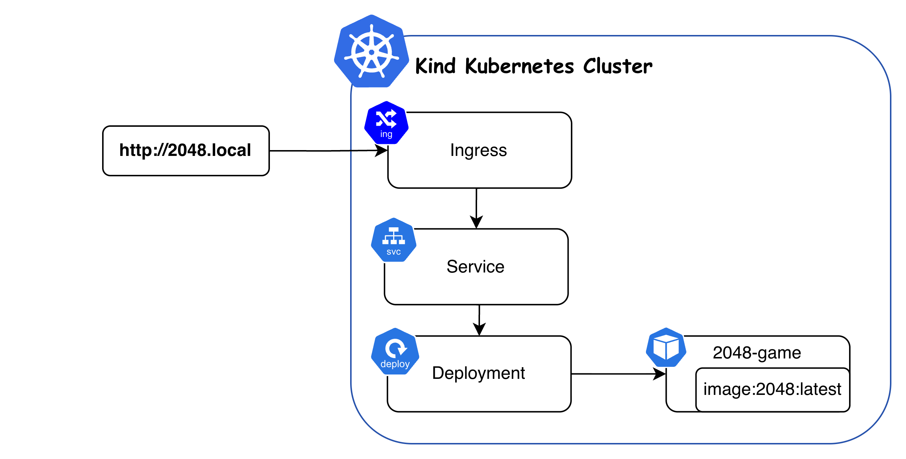

# migrosone-2048case

Verilen case'de open-source 2048 oyunu containerize edilerek Kubernetes ortamında çalıştırılmış ve Ingress üzerinden erişilebilir hale getirilmiştir.

İlk aşamada open source olarak bulduğum 2048 oyununu aşağıdaki github linkinden cloneladım.

```
git clone https://github.com/gabrielecirulli/2048.git app
```

Uygulama bir container içerisinde çalışacak şekilde Dockerfile oluşturdum

```
docker build -t 2048:latest .
```

Sonrasında kuberntes tarafındaki işlemlere başladım.

Öncelikle bir cluster'a ihtiyacım vardı tek node'lu bir cluster işimi görecekti bu yüzden 2048-cluster adında single node kubernetes cluster oluşturulmuştur

```
kind create cluster --config kind-config.yaml --name 2048-cluster
```

```
kind: Cluster
apiVersion: kind.x-k8s.io/v1alpha4
nodes:
  - role: control-plane
    kubeadmConfigPatches:
      - |
        kind: InitConfiguration
        nodeRegistration:
          kubeletExtraArgs:
            node-labels: "ingress-ready=true"
    extraPortMappings:
      - containerPort: 80
        hostPort: 80
        protocol: TCP
```

```
handefettahoglu@Hande-MacBook-Air 2048-k8s % kubectl get no
NAME                         STATUS   ROLES           AGE   VERSION
2048-cluster-control-plane   Ready    control-plane   48s   v1.35.0
```


Kind cluster local Docker image'ları direkt görmediği için image manuel olarak node'a yükledim

```
handefettahoglu@Hande-MacBook-Air 2048-k8s % kind load docker-image 2048:latest --name 2048-cluster
Image: "2048:latest" with ID "sha256:d72af2fc5a58a65dc003b1e935ed65dc034696e03a30cf769338adb6ecfbbe34" not yet present on node "2048-cluster-control-plane", loading...
```

ingress-nginx namespace'ine aşağıdaki komutla kurulum yaptım

```
kubectl apply -f https://raw.githubusercontent.com/kubernetes/ingress-nginx/main/deploy/static/provider/kind/deploy.yaml
```

Sonrasında oluşturduğum deploy service ve ingress yamlları sırayla 2048 namespace'ine apply ettim.

```
handefettahoglu@Hande-MacBook-Air k8s % kubectl get pods -n 2048
NAME                         READY   STATUS    RESTARTS   AGE
game-2048-54ccdf4794-455qw   1/1     Running   0          34s
```
```
handefettahoglu@Hande-MacBook-Air k8s % kubectl get svc -n 2048 
NAME            TYPE        CLUSTER-IP     EXTERNAL-IP   PORT(S)   AGE
game-2048-svc   ClusterIP   10.96.125.51   <none>        80/TCP    29s
```
```
handefettahoglu@Hande-MacBook-Air k8s % kubectl get deploy -n 2048
NAME        READY   UP-TO-DATE   AVAILABLE   AGE
game-2048   1/1     1            1           48s
```
```
handefettahoglu@Hande-MacBook-Air k8s % kubectl get ingress -n 2048
NAME                CLASS   HOSTS        ADDRESS     PORTS   AGE
game-2048-ingress   nginx   2048.local   localhost   80      83s
```

2048.local'e erişebilmek için etc/hostumda 127.0.0.1 e kayıt açtım ve uygulamaya erişebildim

Genel yapı aşağıdaki şekildedir.

```
2048-k8s/
├── Dockerfile            
├── nginx.conf            
├── app/                  
└── k8s/
    ├── kind-config.yaml  
    ├── deployment.yaml   
    ├── svc.yaml          
    └── ingress.yaml      
```


Genel mimari:

