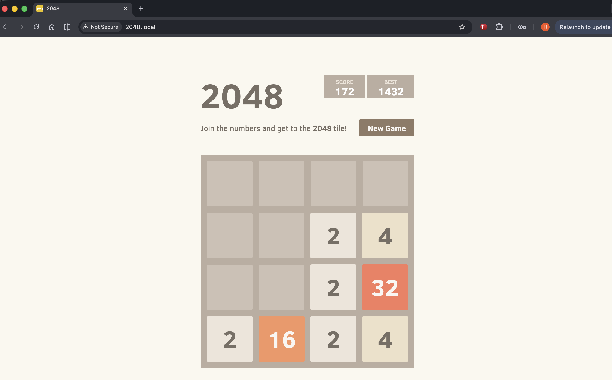

# migrosone-2048case

In the given case, the open-source 2048 game was containerized and run in a Kubernetes environment, making it accessible via ingress.

## 📥 Application Source

Initially, I cloned the 2048 game, which I found as open source, from the following gitHub link.


```
git clone https://github.com/gabrielecirulli/2048.git app
```
## 🐳 Containerization

I created a Dockerfile so the application will run inside a container. This ensures the application runs consistently across different environments by bundling all dependencies and configurations together. It also makes the application portable and suitable for deployment in Kubernetes, where container-based workloads are the standard.

```
docker build -t 2048:latest .
```
## ☸️ Kubernetes Cluster Setup (Kind)

After that, I started the processes on the Kubernetes side.

First, I needed a cluster; a single-node cluster would suffice, so a single-node Kubernetes cluster named 2048-cluster was created.

```
kind: Cluster
apiVersion: kind.x-k8s.io/v1alpha4
nodes:
  - role: control-plane
    kubeadmConfigPatches:
      - |
        kind: InitConfiguration
        nodeRegistration:
          kubeletExtraArgs:
            node-labels: "ingress-ready=true"
    extraPortMappings:
      - containerPort: 80
        hostPort: 80
        protocol: TCP
```
After applying the YAML above, we see that the node is created as shown below.

```
handefettahoglu@Hande-MacBook-Air 2048-k8s % kubectl get no
NAME                         STATUS   ROLES           AGE   VERSION
2048-cluster-control-plane   Ready    control-plane   48s   v1.35.0
```

## 📦 Image Distribution

Since Kind Cluster doesn't directly see local docker images, I manually uploaded the image to the node.

```
handefettahoglu@Hande-MacBook-Air 2048-k8s % kind load docker-image 2048:latest --name 2048-cluster
Image: "2048:latest" with ID "sha256:d72af2fc5a58a65dc003b1e935ed65dc034696e03a30cf769338adb6ecfbbe34" not yet present on node "2048-cluster-control-plane", loading...
```

## 🌐 Ingress Controller Setup

I installed it in the ingress-nginx namespace with the following command.

Ingress is a routing layer in a Kubernetes cluster that exposes services to the outside world. It receives incoming traffic based on domain  or URL path instead of IP addresses and forwards it to the relevant services.

```
kubectl apply -f https://raw.githubusercontent.com/kubernetes/ingress-nginx/main/deploy/static/provider/kind/deploy.yaml
```

## ⚙️ Application Deployment

After that, I applied the deploy, service and ingress yaml files I created to the 2048 namespace, one after the other.


```
handefettahoglu@Hande-MacBook-Air k8s % kubectl get svc -n 2048 
NAME            TYPE        CLUSTER-IP     EXTERNAL-IP   PORT(S)   AGE
game-2048-svc   ClusterIP   10.96.125.51   <none>        80/TCP    29s
```
```
handefettahoglu@Hande-MacBook-Air k8s % kubectl get deploy -n 2048
NAME        READY   UP-TO-DATE   AVAILABLE   AGE
game-2048   1/1     1            1           48s
```

```
handefettahoglu@Hande-MacBook-Air k8s % kubectl get ingress -n 2048
NAME                CLASS   HOSTS        ADDRESS     PORTS   AGE
game-2048-ingress   nginx   2048.local   localhost   80      83s
```
```
handefettahoglu@Hande-MacBook-Air k8s % kubectl get pods -n 2048
NAME                         READY   STATUS    RESTARTS   AGE
game-2048-54ccdf4794-455qw   1/1     Running   0          34s
```

## 🌍 Access

To access 2048.local, I created an entry for 127.0.0.1 in my etc/host and was able to access the application.



## The general file structure is as follows:

```
2048-k8s/
├── Dockerfile            
├── nginx.conf            
├── app/                  
└── k8s/
    ├── kind-config.yaml  
    ├── deployment.yaml   
    ├── svc.yaml          
    └── ingress.yaml      
```


## Architecture:


